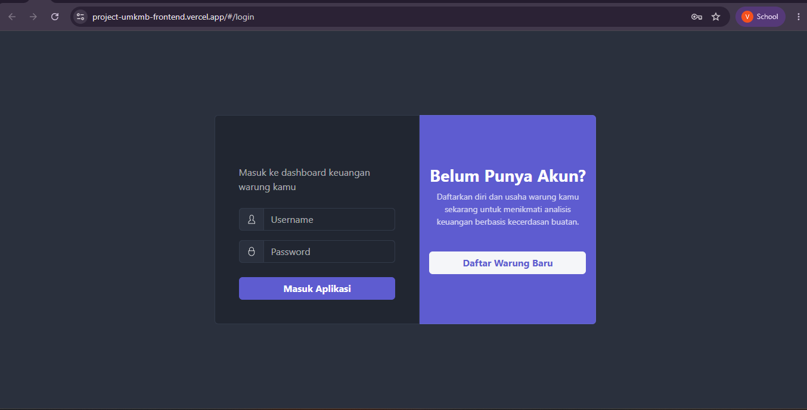

# UMKM Bersama 🏪

> Smart Financial Assistant for Small Warung in Indonesia

UMKM Bersama is an web application that helps small warung owners manage their business finances automatically — from cash flow prediction, anomaly detection, to automated business recommendations displayed directly on the dashboard.

**Team:** CC26-PSU328 | Coding Camp 2026 powered by DBS Foundation  
**Theme:** Financial Technology Revolution for the Young Generation

---

## The Problem

Over 64 million MSMEs (UMKM) in Indonesia, yet most small warung owners still manage their finances manually. This leads to:

- Difficulty distinguishing capital from profit
- Undetected unusual expenditures draining profits
- Inability to predict cash flow and stock needs
- Transaction data never turned into actionable business insights

---

## The Solution

UMKM Bersama transforms raw transaction data into strategic business decisions through four core AI-powered features:

| Feature | Description |
|---------|-------------|
| 💰 Cash Flow Forecast | Daily cash flow prediction using LSTM Deep Learning |
| 🔔 Anomaly Alert | Automatic detection of unusual expenditures |
| 📊 BCG Matrix Dashboard | Product performance classification |
| ✨ Advisory Layer | Automated business recommendations |

---

## System Architecture
Frontend (Vercel)
↓
Backend API (Render)
↓
AI Service (Railway)
├── /api/ai/cashflow-forecast  → LSTM Model
├── /api/ai/bcg-matrix         → K-Means Model
├── /api/ai/anomaly            → Isolation Forest
└── /api/ai/advisory           → Advisory Layer

---

## Repository Structure
umkm-bersama/
├── ai-service/     ← AI Engineer
├── backend/        ← Full-Stack Backend
├── frontend/       ← Full-Stack Frontend
└── README.md

Each folder has its own README with setup instructions:
- [AI Service README](./ai-service/README.md)
- [Backend README](./backend/README.md) ← filled by BE team
- [Frontend README](./frontend/README.md) ← filled by FE team

---

## Screenshots

---

  

---

## Production URLs

| Service | URL |
|---------|-----|
| Frontend | *(filled by FE team)* |
| Backend API | *(filled by BE team)* |
| AI Service | https://umkm-bersama-production.up.railway.app |
| AI Docs | https://umkm-bersama-production.up.railway.app/docs |

---

## Tech Stack

| Layer | Technology |
|-------|-----------|
| Frontend | React.js, Tailwind CSS, Vercel |
| Backend | Express.js, MySQL, Render |
| AI Service | TensorFlow, FastAPI, Scikit-learn, Railway |
| Data Science | Python, Pandas, Scikit-learn, Google Colab |

---

## Team

| Name | Path | Student ID |
|------|------|-----------|
| Hafizh Rafa Naufaldy | Data Scientist | CDCC008D6Y1862 |
| Virginia Stevani S. | AI Engineer | CACC319D6X2205 |
| Salamah | Full-Stack Developer | CFCC809D6X2308 |